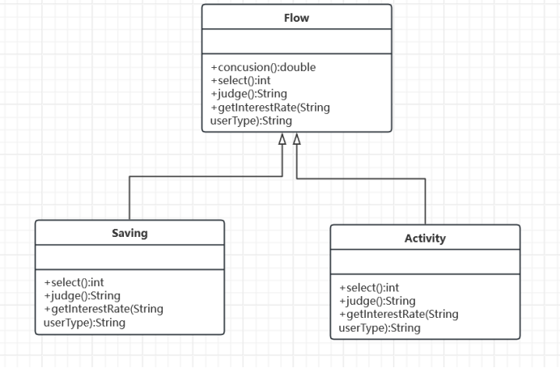

## 第8次作业
一．作业内容
请完成以下五道作业，根据要求画类图及给出代码实现。
1. 某在线游戏支持多人联机对战，每个玩家都可以加入某一战队组成联盟，当战队中某一成员受到敌人攻击时将给所有盟友发送通知，盟友收到通知后将作出响应。使用观察者模式设计并实现该过程。
2. 某纸牌游戏软件中，人物角色具有入门级(Primary)、熟练级(Secondary)、高手级(Professional)和骨灰级(Final)四种等级，角色的等级与其积分相对应，游戏胜利将增加积分，失败则扣除积分。入门级具有最基本的游戏功能play() ，熟练级增加了游戏胜利积分加倍功能doubleScore()，高手级在熟练级基础上再增加换牌功能changeCards()，骨灰级在高手级基础上再增加偷看他人的牌功能peekCards()。现使用状态模式来设计该系统，绘制类图并编程实现。
3. 某系统需要对重要数据（如用户密码）进行加密，并提供了几种加密方案（如凯撒加密、DES加密等），对该加密模块进行设计，使得用户可以动态选择加密方式。要求绘制类图并编程模拟实现。
4. 某银行软件的利息计算流程如下：系统根据账户查询用户信息；根据用户信息判断用户类型；不同类型的用户使用不同的利息计算方式计算利息（如活期账户CurrentAccount和定期账户SavingAccount具有不同的利息计算方式）；显示利息。现使用模板方法模式来设计该系统，绘制类图并编程实现。
5. （模式综合题）利用设计模式，设计并实现一个加减计算器，设计时需考虑系统的可扩展性。（卓越班同学必做，其他班级选做）

## 第一题-观察者模式


```java
public interface Observer {
    void update();
}
public class ConcreteObserver implements Observer {
    @Override
    public void update() {
        System.out.println("等一等，马上来！");
    }
}
public abstract class Subject {
    protected List<Observer> observers = new ArrayList<>();

    public abstract void attach(Observer observer);

    public abstract void detach(Observer observer);

    public abstract void notifyObserver();
}
public class ConcreteSubject extends Subject {
    @Override
    public void attach(Observer observer) {
        observers.add(observer);
    }

    @Override
    public void detach(Observer observer) {
        observers.remove(observer);
    }

    @Override
    public void notifyObserver() {
        System.out.println("救命！");
        for (Observer obs : observers) {
            obs.update();
        }
    }
}
public class Client {
    public static void main(String[] args) {
        Subject subject = new ConcreteSubject();
        Observer observer = new ConcreteObserver();
        subject.attach(observer);
        subject.notifyObserver();
    }
}
```
## 第二题-状态模式


```java
// 状态接口：定义角色状态的行为
interface PlayerState {
    void play();
    void doubleScore();
    void changeCards();
    void peekCards();
}

// 具体状态类：入门级状态
class PrimaryState implements PlayerState {
    @Override
    public void play() {
        System.out.println("Play basic game.");
    }

    @Override
    public void doubleScore() {
        System.out.println("This feature is not available in Primary level.");
    }

    @Override
    public void changeCards() {
        System.out.println("This feature is not available in Primary level.");
    }

    @Override
    public void peekCards() {
        System.out.println("This feature is not available in Primary level.");
    }
}

// 具体状态类：熟练级状态
class SecondaryState implements PlayerState {
    @Override
    public void play() {
        System.out.println("Play basic game.");
    }

    @Override
    public void doubleScore() {
        System.out.println("Double the score.");
    }

    @Override
    public void changeCards() {
        System.out.println("This feature is not available in Secondary level.");
    }

    @Override
    public void peekCards() {
        System.out.println("This feature is not available in Secondary level.");
    }
}

// 具体状态类：高手级状态
class ProfessionalState implements PlayerState {
    @Override
    public void play() {
        System.out.println("Play basic game.");
    }

    @Override
    public void doubleScore() {
        System.out.println("Double the score.");
    }

    @Override
    public void changeCards() {
        System.out.println("Change cards.");
    }

    @Override
    public void peekCards() {
        System.out.println("This feature is not available in Professional level.");
    }
}

// 具体状态类：骨灰级状态
class FinalState implements PlayerState {
    @Override
    public void play() {
        System.out.println("Play basic game.");
    }

    @Override
    public void doubleScore() {
        System.out.println("Double the score.");
    }

    @Override
    public void changeCards() {
        System.out.println("Change cards.");
    }

    @Override
    public void peekCards() {
        System.out.println("Peek other players' cards.");
    }
}

// 环境类：维护一个对具体状态对象的引用
class Player {
    private PlayerState state;

    public Player(PlayerState state) {
        this.state = state;
    }

    public void setState(PlayerState state) {
        this.state = state;
    }

    public void play() {
        state.play();
    }

    public void doubleScore() {
        state.doubleScore();
    }

    public void changeCards() {
        state.changeCards();
    }

    public void peekCards() {
        state.peekCards();
    }
}

// 客户端测试类
public class Client {
    public static void main(String[] args) {
        // 创建角色对象，并设置初始状态为入门级
        Player player = new Player(new PrimaryState());

        // 游戏进行中，触发不同的操作
        player.play();  // 入门级状态下的游戏
        player.doubleScore();  // 入门级状态下无法加倍积分

        // 切换到高手级状态
        player.setState(new ProfessionalState());
        player.play();  // 高手级状态下的游戏
        player.changeCards();  // 高手级状态下的换牌操作

        // 切换到骨灰级状态
        player.setState(new FinalState());
        player.play();  // 骨灰级状态下的游戏
        player.peekCards();  // 骨灰级状态下的偷看他人牌操作
    }
}
```
## 第三题-策略模式


```java
// 加密模块接口
interface EncryptionStrategy {
    String encrypt(String data);
}

// 凯撒加密实现
class CaesarEncryption implements EncryptionStrategy {
    @Override
    public String encrypt(String data) {
        // 实现凯撒加密算法
        return "Caesar encrypted data";
    }
}

// DES加密实现
class DESEncryption implements EncryptionStrategy {
    @Override
    public String encrypt(String data) {
        // 实现DES加密算法
        return "DES encrypted data";
    }
}

// AES加密实现
class AESCEncryption implements EncryptionStrategy {
    @Override
    public String encrypt(String data) {
        // 实现AES加密算法
        return "AES encrypted data";
    }
}

// 加密模块
class EncryptionModule {
    private EncryptionStrategy encryptionStrategy;

    public void setEncryptionStrategy(EncryptionStrategy strategy) {
        this.encryptionStrategy = strategy;
    }

    public String encryptData(String data) {
        if (encryptionStrategy == null) {
            throw new IllegalStateException("Encryption strategy not set.");
        }
        return encryptionStrategy.encrypt(data);
    }
}

public class Main {
    public static void main(String[] args) {
        // 创建加密模块
        EncryptionModule encryptionModule = new EncryptionModule();

        // 选择加密方式并设置到加密模块中
        encryptionModule.setEncryptionStrategy(new DESEncryption());

        // 加密数据
        String encryptedData = encryptionModule.encryptData("Sensitive data");

        // 输出加密后的数据
        System.out.println("Encrypted data: " + encryptedData);
    }
}
```
## 第四题-模板模式


```java
abstract class Flow {
//    计算利息
    public final double concusion(){
        double balance=select();
        String sort=judge();
//        根据类型类获取利率
        double interestRate=getInterestRate(sort);
        return balance*interestRate;
    }
    //    查询用户信息
    public abstract int select();
    //判断用户的信息
    public abstract String judge();
    // 具体方法：获取利率（钩子方法）
    protected double getInterestRate(String userType) {
        // 默认利率，可根据具体情况重写
        return 0.01;
    }
}
public class Saving extends Flow {
//本金
    @Override
    public int select() {
        return 20000;
    }
//类型
    @Override
    public String judge() {
        return "Saving";
    }
//利率
    @Override
    public double getInterestRate(String userType) {
        if (userType.equals("Saving"))
            return 0.3;
        else
            return super.getInterestRate(userType);
    }
}
public class Activity extends Flow{
    @Override
    public int select() {
        return 20000;
    }

    @Override
    public String judge() {
        return "activity";
    }

    public double getInterestRate(String userType){
        if (userType.equals("activity"))
            return 0.1;
        else
            return super.getInterestRate(userType);
    }
}
public class Client {
    public static void main(String[] args) {
        // 创建活期账户对象
       Flow activity =new Activity();
       double finalmoney=activity.concusion();
        System.out.println("活期用户的利息"+finalmoney);


//        创建定期用户
        Flow Saving =new Saving();
        double finalmoneys=Saving.concusion();
        System.out.println("定期用户的利息"+finalmoneys);
    }
}
```
## 第五题-策略模式


```java
interface CalculationStrategy {
    double calculate(double num1, double num2);
}
class SubtractStrategy implements CalculationStrategy {
    @Override
    public double calculate(double num1, double num2) {
        return num1 - num2;
    }
}
class AddStrategy implements CalculationStrategy {
    @Override
    public double calculate(double num1, double num2) {
        return num1 + num2;
    }
}
class Calculator {
    private CalculationStrategy strategy;

    public Calculator(CalculationStrategy strategy) {
        this.strategy = strategy;
    }

    public void setStrategy(CalculationStrategy strategy) {
        this.strategy = strategy;
    }

    public double calculate(double num1, double num2) {
        return strategy.calculate(num1, num2);
    }
}
public class Client {
    public static void main(String[] args) {
        // 创建加法策略对象
        CalculationStrategy addStrategy = new AddStrategy();
        // 创建减法策略对象
        CalculationStrategy subtractStrategy = new SubtractStrategy();

        // 创建计算器对象，并设置加法策略
        Calculator calculator = new Calculator(addStrategy);
        // 计算并输出结果
        double result1 = calculator.calculate(10, 5);
        System.out.println("10 + 5 = " + result1);

        // 切换策略为减法
        calculator.setStrategy(subtractStrategy);
        // 计算并输出结果
        double result2 = calculator.calculate(10, 5);
        System.out.println("10 - 5 = " + result2);
    }
}
```